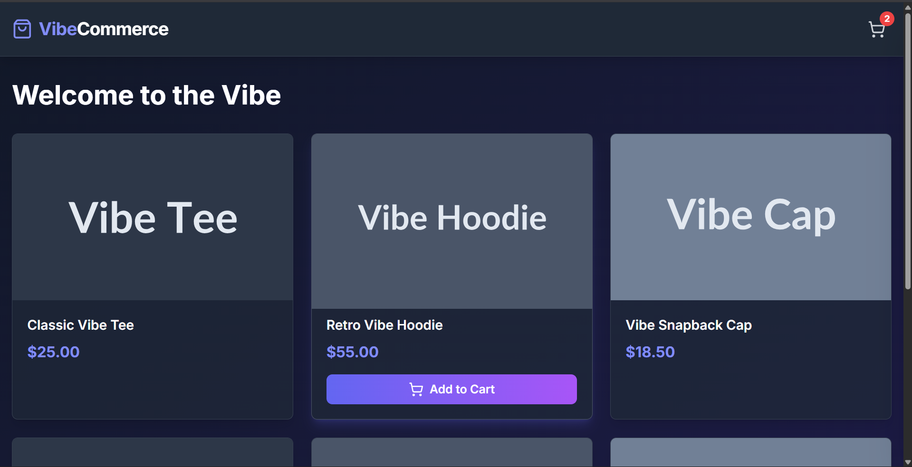
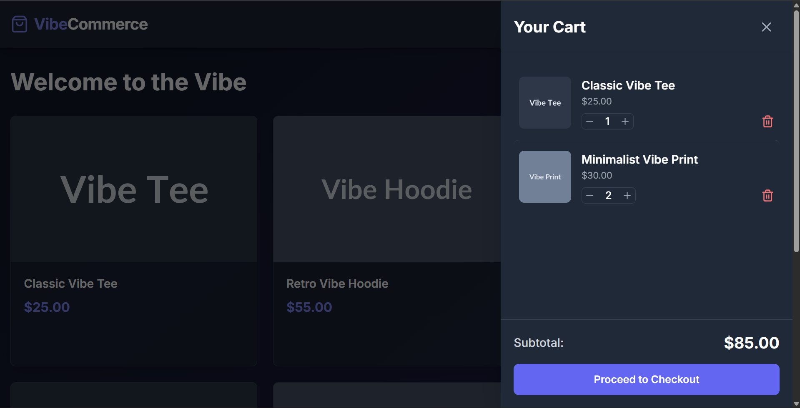
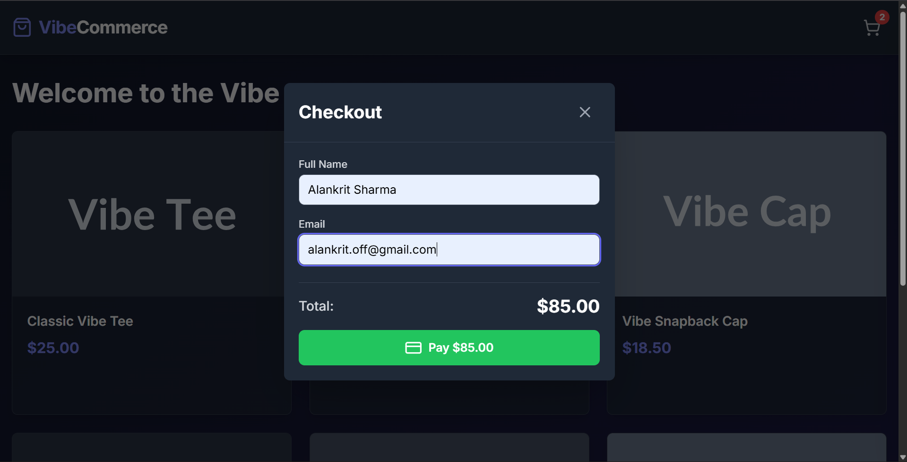

# Vibe Commerce - Mock E-Commerce Cart

This is a full-stack e-commerce shopping cart application. The project features a React frontend and a Node.js/Express backend with a MongoDB database.

## Features

* **Product Catalog:** View a grid of available products.
* **Full Cart Functionality:** Add items, update quantities, and remove items.
* **Persistent State:** Cart is saved in MongoDB and persists across sessions.
* **Real-time Calculations:** Cart subtotal is calculated on the backend.
* **Mock Checkout:** A modal collects user info and simulates an order.
* **Modern UI/UX:** Professional, responsive dark-mode UI with hover effects.

## Tech Stack

* **Frontend:**
    * React (with Hooks)
    * Tailwind CSS (for styling)
    * `axios` (for API requests)
    * `lucide-react` (for icons)
* **Backend:**
    * Node.js
    * Express
    * MongoDB (with Mongoose)
    * `cors` (for cross-origin requests)
* **Tooling:**
    * `nodemon` (for backend auto-reload)
    * Create React App

## Setup and Running the Project

You must have **Node.js** and **MongoDB** installed.

After cloning the repository, you will need to run the backend and frontend in two separate terminals.

### 1. Backend Setup

```bash
# 1. Navigate to the backend folder
cd backend

# 2. Install dependencies
npm install

# 3. Set up Database
# This project uses a .env file for the database string.
#
# A .env.example file is provided.
# Copy it to a new file named .env:
cp .env.example .env
#
# On Windows, use: 
copy .env.example .env

# 4. Run the backend server
npm run dev
# The server will be running on http://localhost:5001
```

### 2. Frontend Setup

```bash
# 1. Navigate to the frontend folder
cd frontend

# 2. Install dependencies
npm install

# 3. Run the frontend app
npm start
# The app will open in your browser at http://localhost:3000
```

### 3. Screenshots

* **Product Page**


* **Cart Sidebar**


* **CHeckout Modal**
